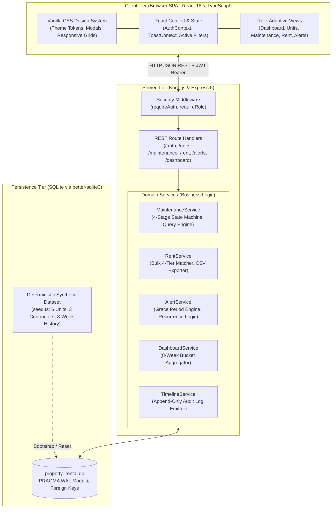

# Architecture

## What are the moving pieces, and how do they talk to each other?

The system is structured as a decoupled, multi-tiered web application designed for clarity, testability, and strict boundary enforcement:

1. **Client Tier (Single-Page Application)**:
   - Built with **React 18** and **TypeScript**, bundled by **Vite**.
   - Styled entirely with an extensible, custom **Vanilla CSS Design System** (custom CSS custom properties, responsive grids, dark/light surface tokens, micro-animations, accessible modal dialogs).
   - Manages user sessions, role-adaptive navigation, client-side optimistic feedback, and UI toasts.
   - Communicates with the backend exclusively over HTTP via standard JSON REST endpoints (`/api/*`), attaching JWT authentication bearer tokens to every privileged request.

2. **Server Tier (RESTful Application Layer)**:
   - Built with **Node.js**, **Express 5**, and **TypeScript**.
   - Follows a layered domain architecture:
     - `routes/`: Declares HTTP route definitions and applies middleware chains.
     - `middleware/`: Enforces JWT verification (`requireAuth`) and role-based access control (`requireRole('property_manager')`).
     - `controllers/`: Handles HTTP status codes, parses request bodies/query params, and formats standardized JSON envelopes.
     - `services/`: Encapsulates all domain logic, transaction boundaries, state machine validation, and business rules (e.g. grace period thresholds, bulk matching algorithms, timeline audit event emissions).
     - `db/`: Manages SQLite connections, PRAGMA optimizations (WAL mode, foreign keys), DDL schemas, and seed execution.

3. **Persistence Tier (Relational Storage)**:
   - Powered by **SQLite** using the high-performance `better-sqlite3` driver.
   - Enforces relational integrity via strict `FOREIGN KEY (ON DELETE RESTRICT / CASCADE)` declarations and `CHECK` constraints (e.g. valid statuses, non-negative amounts, date format validations).
   - Indices placed on frequently searched and filtered columns (`unit_number`, `status`, `priority`, `month`, `contractor_id`).

4. **Static Asset Delivery in Production**:
   - The Express application is configured to serve the production client bundle (`client/dist`) as static assets, with an SPA fallback routing middleware. This allows the entire platform to run as a unified service on a single port (e.g., on Render, Railway, or VPS).

### System Architecture Diagram



### Architectural Interface Snapshots

#### Client Tier Presentation & Executive Analytics
The frontend delivers high-density dashboards, interactive SVG charts, and seamless role-switching for rapid authentication and testing:


---

## Synthetic Dataset Generation & Seeding Pipeline

To ensure that the application's complex business rules (e.g. grace-period overdue recurrence, multi-contractor assignment, 8-week historical resolution metrics, and bulk rent match classifications) could be validated with full real-world fidelity, we implemented a dedicated, deterministic synthetic data generator in [`server/src/db/seed.ts`](file:///c:/Users/Soulyoyo/OneDrive/Documents/takehome-07-property-rental/takehome-07-property-rental/server/src/db/seed.ts):

1. **Deterministic User Archetypes**:
   - 1 Property Manager account (`manager@apexpm.com`) with full portfolio administrative credentials.
   - 3 Specialized Contractor accounts with distinct trade scopes (`dave@plumbingpros.com` for Plumbing, `sarah@sparkyelec.com` for Electrical, and `carlos@finishcarpentry.com` for Carpentry) to test trade-scoped filtering and contractor assignment constraints.

2. **Diverse Rental Unit Portfolio**:
   - 6 distinct units spanning varied rent points ($1,250.00 to $2,400.00/mo), different grace periods (3 to 7 days), active tenants, and 1 archived unit (`Unit 301`) to test soft-archival hiding and restoration.

3. **Multi-Month Financial Ledger Scenarios**:
   - Historical rent payments across consecutive months modeling:
     - Full timely payments (`matched`).
     - Split/partial payments (`underpaid`).
     - Overpayments with credit balances (`overpaid`).
     - Delinquent accounts past the grace period to trigger active navigation badges and alerts.

4. **Multi-Stage Maintenance Tickets & 8-Week Chronological Audit Events**:
   - Tickets populated across every stage of the lifecycle state machine (`Reported`, `Triaged`, `Scheduled`, `Resolved`).
   - Single-contractor and multi-contractor assignments (e.g., plumbing + carpentry co-assigned to emergency water leak damage).
   - 8 weeks of historical `status_change` timeline records distributed across rolling 7-day intervals to generate a realistic resolution trend chart on the executive dashboard.

---

## Where does each piece run?

- **Browser**: React SPA runtime, local token storage (`localStorage`), SVG chart rendering, responsive UI layout.
- **Backend Host (Node.js Process)**: Express application server, middleware authorization pipelines, business rule state machine, CSV generation pipeline, and SQLite database engine running on the local filesystem.
- **Deployment Topology**:
  - **Live Production Instance (Render Web Service)**: Deployed at **[`https://takehome-07-property-rental-j36k.onrender.com`](https://takehome-07-property-rental-j36k.onrender.com)**. The Node process hosts both the REST API and the compiled static React SPA bundle (`client/dist`), connecting to a local persistent SQLite file with WAL mode and automatic bootstrap seeding.
  - In split hosting (Vercel + Render + Supabase): The React frontend deploys to Vercel edge CDN, the Express API deploys to Render web service, and the relational persistence points to managed PostgreSQL with Prisma/Drizzle connection string.

---

## What is the request path for one representative user action, end to end?

### Representative Action: Transitioning a Maintenance Request from *Triaged* to *Scheduled*

```mermaid
sequenceDiagram
    autonumber
    actor PM as Property Manager
    participant UI as React Client (SPA)
    participant Auth as Auth Middleware (JWT)
    participant Controller as MaintenanceController
    participant Service as MaintenanceService
    participant DB as SQLite (better-sqlite3)

    PM->>UI: Selects "Dave Miller" & Clicks "Schedule Work"
    UI->>Auth: PATCH /api/maintenance/3/status { status: "Scheduled", notes: "..." }
    Auth->>Auth: Verify JWT & extract { userId: 1, role: 'property_manager' }
    Auth->>Controller: updateStatus(req, res)
    Controller->>Service: updateStatus(id: 3, newStatus: 'Scheduled', userId: 1, role: 'property_manager')
    
    Service->>DB: SELECT * FROM maintenance_requests WHERE id = 3
    DB-->>Service: Returns Request (current: 'Triaged')
    
    rect rgb(20, 30, 45)
        Note over Service,DB: State Machine Contractor Enforcement (Goal 4)
        Service->>DB: SELECT COUNT(*) FROM maintenance_contractors WHERE request_id = 3
        DB-->>Service: count: 1 (Contractor assigned)
    end

    Service->>DB: UPDATE maintenance_requests SET status = 'Scheduled'
    Service->>DB: INSERT INTO maintenance_timeline (event_type: 'status_change', old: 'Triaged', new: 'Scheduled')
    DB-->>Service: Mutation & Append-Only Log Confirmed
    
    Service-->>Controller: Updated Request Object & Timeline
    Controller-->>UI: HTTP 200 { request: {...}, message: "..." }
    UI->>PM: Updates badge to "Scheduled", appends timeline entry, shows success toast
```



1. **User Action (Browser)**:
   - A property manager views Maintenance Request #3 in the UI.
   - They select contractor "Dave Miller" from the dropdown and click "Assign".
   - They then click the action button: **"Schedule Work"**.

2. **Network Request**:
   - The browser dispatches:
     ```http
     PATCH /api/maintenance/3/status HTTP/1.1
     Host: localhost:4000
     Authorization: Bearer <jwt_token>
     Content-Type: application/json

     {
       "status": "Scheduled",
       "notes": "Coordinated with tenant for Tuesday 10am"
     }
     ```

3. **Middleware Verification (`server/src/middleware/auth.ts`)**:
   - `requireAuth` extracts the bearer token, verifies the cryptographic signature with `config.jwtSecret`, extracts `{ userId: 1, role: 'property_manager' }`, and attaches it to `req.user`.

4. **Controller Routing (`server/src/controllers/maintenance.controller.ts`)**:
   - `MaintenanceController.updateStatus` parses request ID `3`, checks that target status `'Scheduled'` is provided, and invokes `MaintenanceService.updateStatus(3, 'Scheduled', 1, 'property_manager', notes)`.

5. **Domain State Machine Validation (`server/src/services/maintenance.service.ts`)**:
   - `MaintenanceService` retrieves Request #3 from SQLite.
   - Validates that current status is `'Triaged'`.
   - **Enforces Requirement 4 & 5 Rule**: Queries `SELECT COUNT(*) FROM maintenance_contractors WHERE request_id = 3`.
     - *If 0 contractors assigned*: Throws HTTP 422: `"Illegal transition: Cannot move into 'Scheduled' status without an assigned contractor."`
     - *Since Dave Miller is assigned (count = 1)*: Passes validation.

6. **Database Mutation & Append-Only Audit Logging (`better-sqlite3`)**:
   - Executes `UPDATE maintenance_requests SET status = 'Scheduled', updated_at = datetime('now') WHERE id = 3`.
   - Invokes `TimelineService.logEvent(3, 'status_change', 'Triaged', 'Scheduled', 1, notes)`.
   - Inserts immutable audit row into `maintenance_timeline`:
     ```sql
     INSERT INTO maintenance_timeline (request_id, event_type, old_value, new_value, user_id, notes)
     VALUES (3, 'status_change', 'Triaged', 'Scheduled', 1, 'Coordinated with tenant for Tuesday 10am');
     ```

7. **HTTP Response & Client Reactivity**:
   - Server responds with HTTP 200 and the updated request object:
     ```json
     {
       "request": { "id": 3, "status": "Scheduled", ... },
       "message": "Request status transitioned to \"Scheduled\"."
     }
     ```
   - Client updates the status badge to `Scheduled` (cyan badge), refreshes the immutable audit timeline displaying the new event with timestamp and author, updates dashboard counters, and displays a success toast notification.

#### End-to-End State Machine in the Interface
The screenshots below demonstrate the central maintenance desk, the enforced contractor guard for the `Scheduled` state, and the reopening rule strictly returning to `Triaged`:


#### Server-Enforced Contractor Scoping (Goal 1 & 5)
Contractors only receive maintenance requests specifically assigned to their accounts, with all units, rent data, and assignment management blocked by the server:


---

## What did you decide *not* to build, and why?

1. **Client-Side Data Filtering & Sorting**:
   - *Decision*: We deliberately did not load all requests into the browser to filter in memory.
   - *Reason*: Requirement 6 explicitly mandates: *"All of this must happen on the server — do not load every request into the browser and filter there."* Client-side filtering breaks at scale when thousands of requests accumulate. All search terms, unit filters, status filters, priority filters, sorting, and pagination are executed via SQL `WHERE`, `ORDER BY`, `LIMIT`, and `OFFSET`.

2. **Automatic Realtime WebSocket Connections**:
   - *Decision*: We chose RESTful polling (with 15-second background alert badge sync) rather than a full WebSocket infrastructure.
   - *Reason*: For a property portfolio of dozens of units, persistent bi-directional WebSockets introduce unnecessary operational complexity, connection teardown edge cases on mobile sleep, and horizontal scaling state issues on serverless or sleeping free-tier hosts. Clean REST endpoints with stale-while-revalidate caching provide rock-solid reliability with zero socket reconnection overhead.

3. **Mutable Audit Trail (Soft Edits / Deletes)**:
   - *Decision*: We rejected adding any update or delete endpoints to the `maintenance_timeline` table.
   - *Reason*: Requirement 9 strictly requires: *"Nothing in this timeline can be edited or deleted after the fact, including by property managers."* Any `PUT`, `PATCH`, or `DELETE` request sent to `/api/maintenance/:id/timeline` is immediately rejected with `405 Method Not Allowed`. Audit integrity must be guaranteed by system design.

4. **Complex Third-Party UI Component Libraries (e.g. MUI, Tailwind, AntD)**:
   - *Decision*: Built with pure, modern Vanilla CSS design tokens.
   - *Reason*: Avoids dependency bloat, eliminates CSS-in-JS runtime overhead, ensures rapid initial page load, and provides total control over visual aesthetics and responsiveness.
