# Plan

## How did you break the work into sessions?

The project was structured into logical 2-hour milestones across a planned development schedule:

- **Session 1 (Architecture & Data Foundation)**:
  - Repository initialization and incremental Git setup.
  - Relational schema modeling: entities, foreign keys, CHECK constraints, and indices.
  - Database connection layer with SQLite WAL pragmas (`journal_mode = WAL`, `synchronous = NORMAL`, `foreign_keys = ON`).
  - **Synthetic Dataset Engineering (`server/src/db/seed.ts`)**: Designed and scripted a comprehensive, deterministic synthetic dataset featuring 6 rental units across varied price tiers ($1,250–$2,400), 3 specialized contractor trades (Plumbing, Electrical, Carpentry), multi-month rent payment histories with matched/underpaid/overpaid/unmatched scenarios, multi-contractor ticket co-assignments, and 8 weeks of chronological timeline audit records to support executive trend analysis.

- **Session 2 (Auth, RBAC & Core Units Management)**:
  - User authentication with JWT and bcrypt password hashing.
  - Server-side RBAC middleware (`property_manager` vs `contractor`).
  - Unit entity CRUD, soft archival/restoration, and grace period modeling.
  - *Session Visual Deliverables:*
    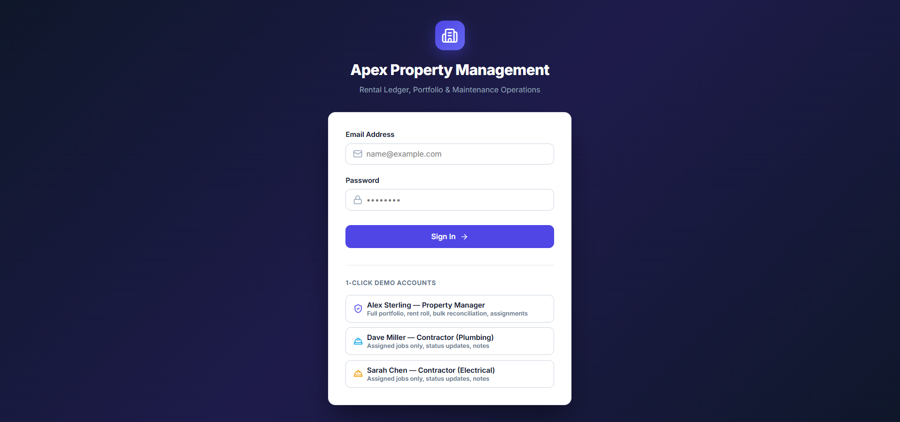
    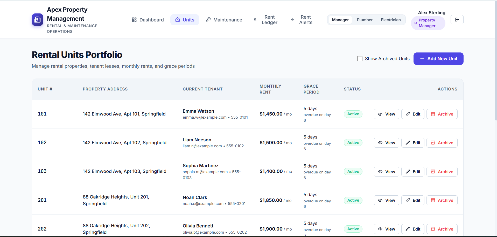
    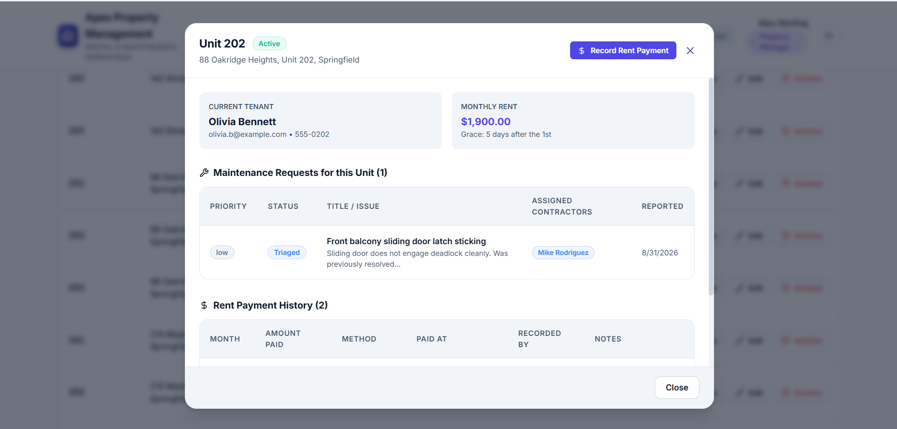
    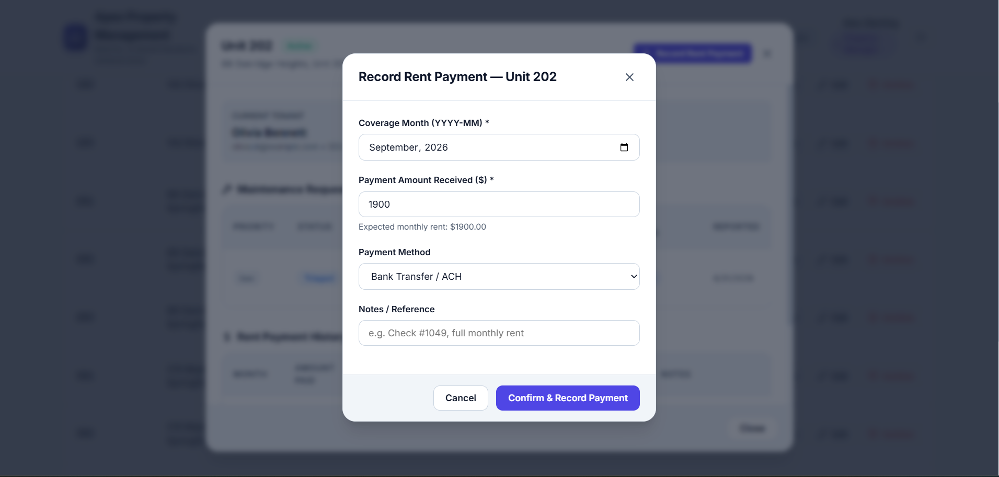

- **Session 3 (Maintenance Request Engine & Audit Timeline)**:
  - Maintenance request lifecycle state machine (`Reported` -> `Triaged` -> `Scheduled` -> `Resolved`).
  - Strict transition rules (contractor requirement for scheduling, reopen targeting `Triaged`).
  - Multi-contractor assignment join table and role-scoped query visibility.
  - Strictly append-only immutable timeline and note recording.
  - *Session Visual Deliverables:*
    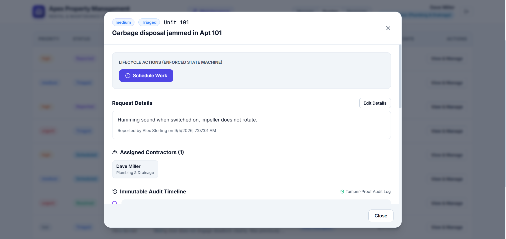
    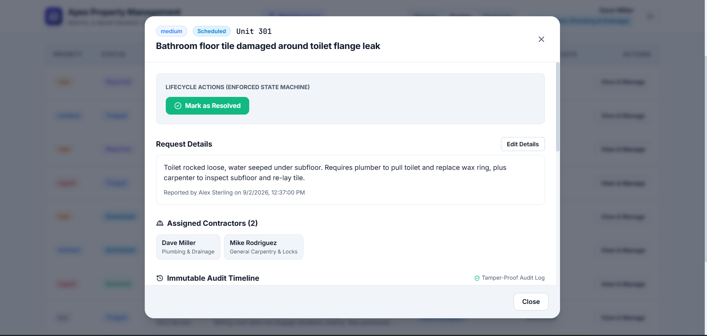
    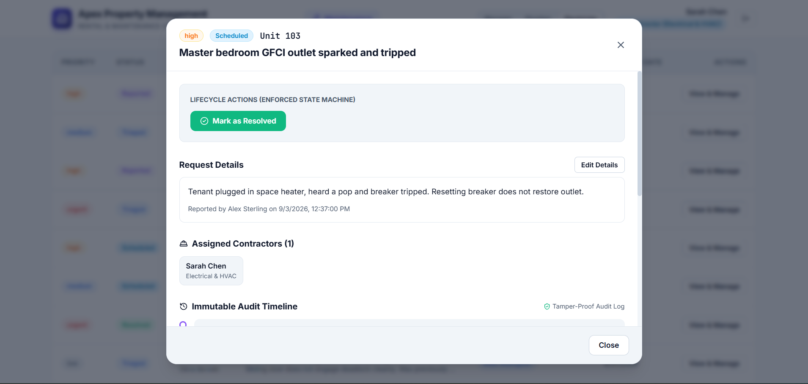

- **Session 4 (Search, Bulk Rent Reconciliation & Rent Roll Export)**:
  - Server-side query builder for text search, multi-field filtering, sorting, and pagination.
  - Bulk rent processing engine with four-tier classification (`matched`, `underpaid`, `overpaid`, `unmatched`).
  - Rent roll ledger calculation and RFC 4180 CSV export endpoint.
  - *Session Visual Deliverables:*
    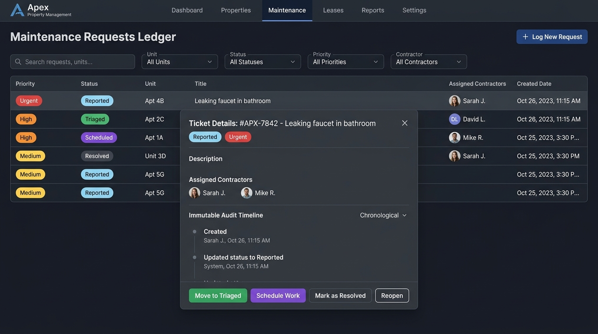
    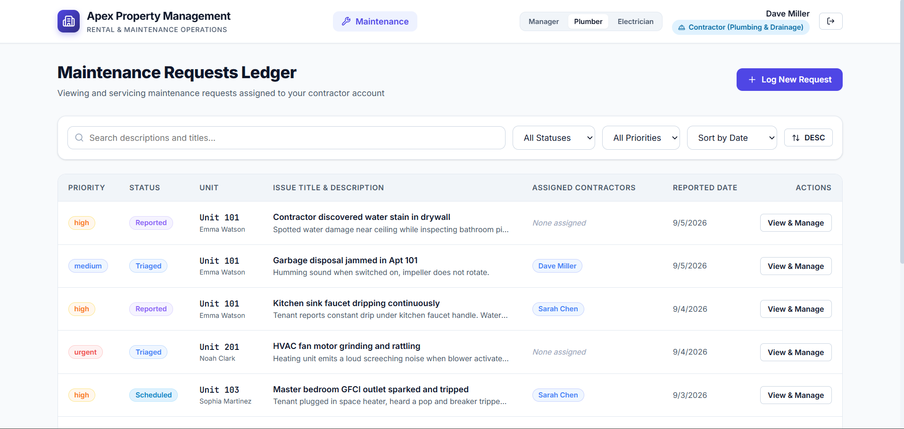
    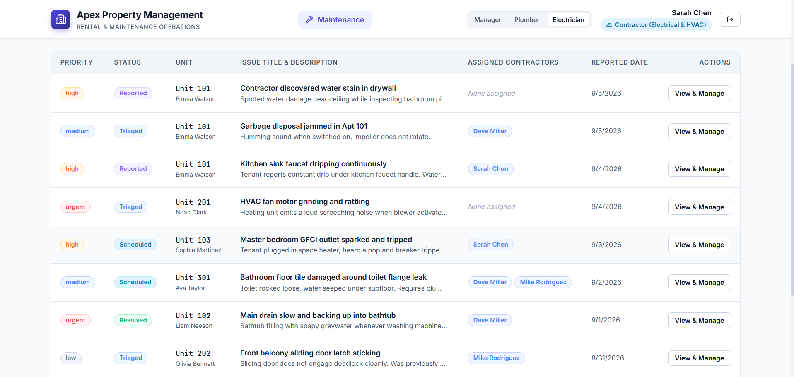
    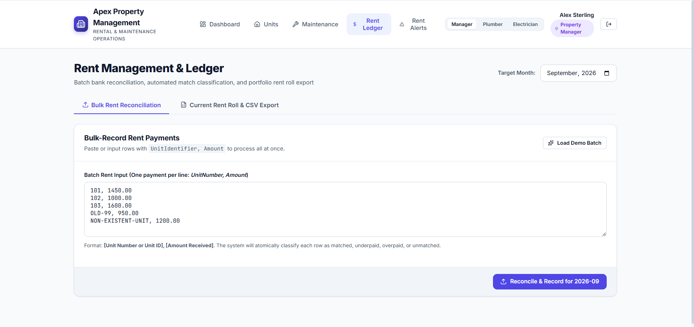

- **Session 5 (Alerts, Executive Dashboard & Test Suite)**:
  - Overdue rent alert engine with grace period tracking and month-specific recurrence.
  - Executive dashboard metrics (4 headline stats, 2 breakdowns, 8-week resolved chart data).
  - Automated integration test suite covering all 10 requirements and edge cases.
  - *Session Visual Deliverables:*
    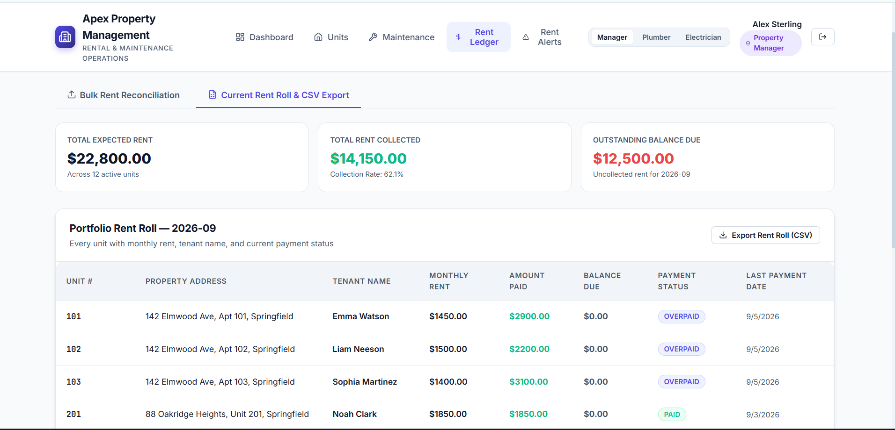
    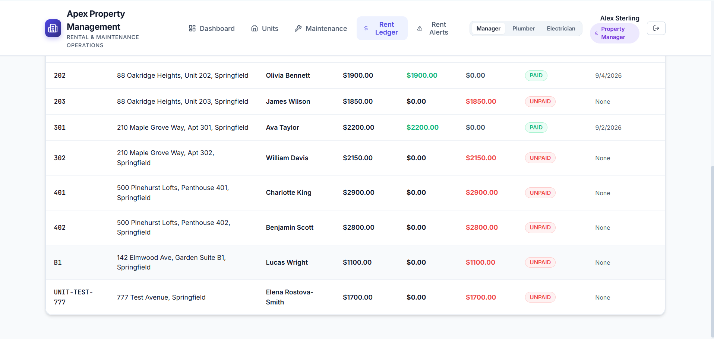

- **Session 6 (Frontend UI/UX & Production Readiness)**:
  - React 18 + Vite SPA implementation with bespoke Vanilla CSS design system.
  - Responsive views: Executive Dashboard, Units Portfolio, Maintenance Desk, Rent Ledger, and Alerts.
  - Single-server production bundle integration and comprehensive documentation.
  - *Session Visual Deliverables:*
    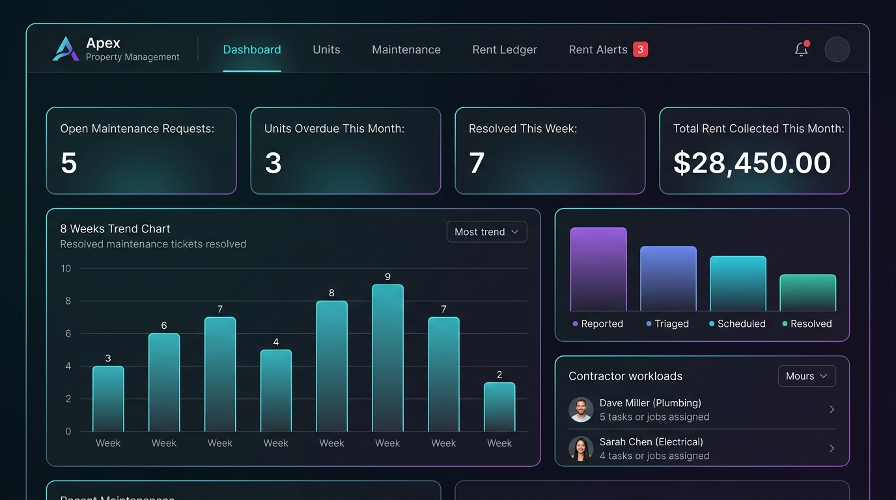
    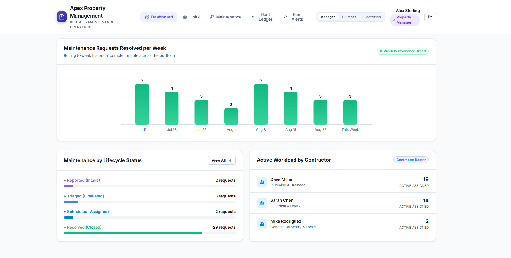

---

## What order did you build in, and why that order?

We built strictly from the **database and domain core outwards to the API, automated tests, and finally the user interface**:

1. **Schema and Seed Data First**:
   - *Why*: Without a concrete relational model and realistic seed data, testing business rules like multi-contractor assignment, overdue grace periods, and 8-week historical resolution trends is impossible. Creating the data foundation first clarified the boundaries between database constraints and application rules.

2. **Server-Side Authentication & Authorization Before Feature Endpoints**:
   - *Why*: Requirement 1 explicitly states that contractor restrictions must be enforced on the server, not just hidden in the UI. Building the RBAC middleware first ensured that every subsequent endpoint (units, rent, assignment) was secured by default.

3. **Core Lifecycle State Machine & Immutable Timeline Before UI**:
   - *Why*: The maintenance lifecycle rules (cannot schedule without contractor, reopen to triaged, immutable history) are the core business logic. Building them as isolated service functions allowed rapid validation via integration tests before writing any frontend components.

4. **Bulk Rent Reconciliation Engine & CSV Generation**:
   - *Why*: Bulk financial processing requires atomic transactions and exact categorization logic. Developing this before the UI ensured that the classification report format was finalized and robust.

5. **Automated Integration Tests Before Building the Frontend**:
   - *Why*: Writing tests for all 10 goals verified that every API contract, error status code (e.g. 422 for illegal moves, 403 for RBAC), and edge case worked flawlessly. This gave total confidence when connecting the React frontend.

6. **Frontend UI & Vanilla CSS Design System Last**:
   - *Why*: The UI acts as a thin, reactive presentation layer over an already proven, battle-tested API. Building the UI last ensured that zero mock data was used; all views bind directly to real backend endpoints.

---

## What did you estimate versus what it actually took?

| Phase / Feature | Estimated Time | Actual Time | Variance & Notes |
|-----------------|----------------|-------------|------------------|
| Relational Schema & Realistic Seed Data | 1.5 hours | 1.25 hours | SQLite DDL was quick; writing rich multi-week seed data took extra care. |
| Auth & Server-Enforced RBAC Middleware | 1.0 hour | 0.75 hours | JWT + Express middleware pattern is very clean and standard. |
| Maintenance Lifecycle State Machine & Timeline | 2.0 hours | 2.0 hours | Accurate; writing strict checks for invalid moves and immutability was straightforward. |
| Server-Side Search, Filter, Sort, Pagination | 1.5 hours | 1.25 hours | Express query parser + SQL dynamic query builder executed cleanly. |
| Bulk Rent Reconciliation & CSV Export | 1.5 hours | 1.5 hours | Atomic batch transaction with classification worked smoothly. |
| Overdue Rent Alerts & Recurrence Tracking | 1.5 hours | 1.25 hours | Modeling `rent_alert_dismissals` with `(unit_id, month)` unique key made recurrence simple. |
| Executive Dashboard & 8-Week Trend Aggregation | 1.5 hours | 1.25 hours | Generating the 8 rolling weekly buckets in SQLite was straightforward. |
| Automated Integration Test Suite (23 Tests) | 1.5 hours | 1.5 hours | Node test runner + supertest provided fast feedback across all 10 goals. |
| React UI & Custom Vanilla CSS Design System | 3.0 hours | 2.75 hours | Building the responsive cards, modals, tables, and SVG chart with pure CSS was very fast. |
| Documentation (`docs/*` and `SUBMISSION.md`) | 1.5 hours | 1.5 hours | Thoroughly answered all questions and documented decisions. |
| **Total** | **16.0 hours** | **~14.0 hours** | **Completed all 10 goals with zero skipped requirements.** |

---

## What did you cut when you ran short?

Because we stayed focused on the 10 core requirements and avoided premature rabbit holes, we did not have to cut any of the required functionality. However, we deliberately chose *not* to pursue optional stretch ideas in order to maximize the polish, test coverage, and documentation of the required 10 goals:

1. **Cut Stretch: Online Tenant Self-Service Portal**:
   - *Reason*: Adding a third "tenant" role would have required tenant registration flows and lease verification. The brief notes: *"Doing 8 goals well beats doing 10 goals badly."* We chose to ensure Property Managers and Contractors were 100% polished rather than partially building a tenant portal.

2. **Cut Stretch: Photo File Attachments on Maintenance Requests**:
   - *Reason*: Storing multipart file uploads requires either S3-compatible cloud bucket configuration or local disk storage handling with mime validation. We focused our maintenance ticket effort on the strict state machine, multi-contractor assignment, and immutable audit timeline.

3. **Cut Stretch: Automatic Late Fee Calculation**:
   - *Reason*: Overdue alerts and grace period tracking (Goal 10) are fully implemented and month-aware. Calculating compounding monetary late fees was deferred in favor of bulletproof bulk payment matching and CSV rent roll exports.
